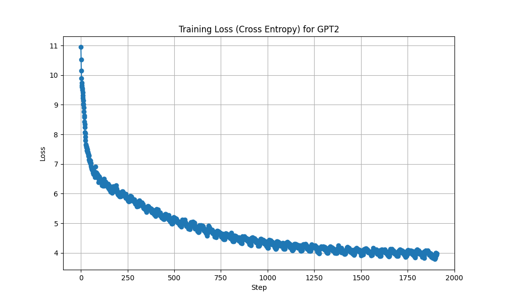

## Pretraining LLM 
Build GPT2/GPT3 from scratch, following from Andrej Karpathy's [Video](https://www.youtube.com/watch?v=l8pRSuU81PU)
.

We trained GPT-2 from scratch using 4 A10 GPUs with Distributed Data Parallel (DDP). 
```bash
torchrun --standalone --nproc_per_node=4 train_gpt2_ddp.py
```
The training utilized 1 billion tokens from the Fineweb dataset, processed in about 2000 batches, each containing approximately 0.5 million tokens. Leveraging computational and algorithmic optimization tricks, we accelerated the training speed by about 10 times, thereby cutting down the pre-training duration to approximately an hour and a half.

